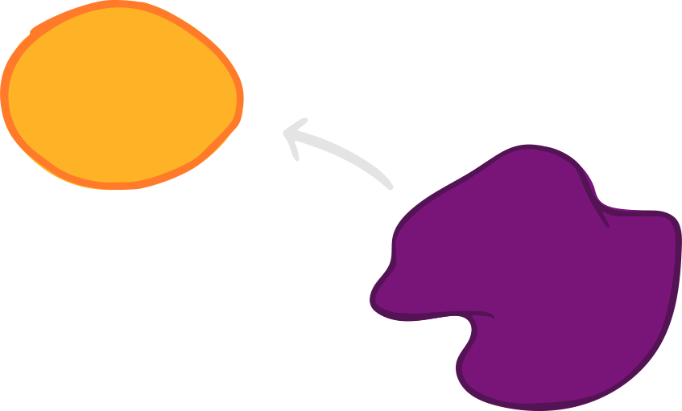

<!-- _class: main -->

# All code sucks

<!-- 
Who has ever felt that all code sucks? (except what you are currently working on)
-->

---
<!-- _class: question -->

## What is code?

Codified Common Knowledge
of All The Developers

<!--
Before we get deep into the topic we would like to clarify what is code.

Code is Codified Common Knowledge of All The Developer who ever worked on the codebase. This is very important to keep in mind. That when we talk about code, we are actually talk about knowledge, understanding of the world that got automated.
-->

---
<!-- _class: lead -->

# Why does code suck?

<!--
Now, back to the topic. First answer the question ‘Why does code suck?’
-->

---

## Your code is not what you think

<!--
Every company works in a business domain and software engineers are there to write software that is automating some of the workflows.

Let’s pick a business domain for ourselves. Let’s use Monster Hunting. 
Do you know Monster hunting? No…. So even though you can not see it, there are plenty of monsters live around us. And this is our business. When we are being called, we go hunt the monster down and collect the money. 

I’m going to mark with this spot our business domain. Our company is working in this business domain. And there is an infinite space around it, that is currently not covered by the business. For example we are not dealing with nice monsters that are more like pets. We are only dealing with real dangerous monsters.
-->

---

## Your code is not what you think

<!--
And in this business domain we have automated a couple of things. The main thing that we automated is monster detector.
-->

---

## What are your expectations?

<!--
So this is our app.
It is a monster detector and an alarm system.

You can see that it can show you if there is a monster in front of you, how far the monster is away and how dangerous it is. And you can call us if you want us to hunt the monster down.
Do you think it’s a good app?
Do you think we should improve it?

* Send gps coordinates
* Show the hunting price
* Automatically alert
* Automatically call
* etc.

-->
---

<!--
Let’s visualize it. 
Here is the app currently on the domain canvas. But our offering doesn’t match your needs.  What is our business doing in this case?
-->

---

<!--
TODO rephrase this

We try to change our automation to server more the needs. Great. So we have some ideas how to serve those needs, new specifications and we start working on it tomorrow.
But what happens tomorrow?
The world is not a stable place. You guys are having different needs every day, the same applies to our users as well. If we take time into picture...

TODO monster evolution
-->

---

## The world keeps changing

<!--
… we get to this model. Once we have moved our software to serve the new needs. It is already a bit late. The needs have changed again… So we move again and again.

But this is not enough to have sucky code. What other thing is crucial when we want to serve the needs best?

Time, this is what we are talking about here. If we can move fast into the new domain we could start serving our new customers faster.

-->

---

## The world keeps changing

<!--
And because we don’t have really time really change our software, we end up like this.

We bend and flex the software into shape.
-->

---

## The world keeps changing

<!--
So far we have discussed some external forces that makes our code suck. But there is something else what we have to discuss. The people who are doing these changes...
-->

---
<!-- _class: lead -->

# The developers

---

## What developer should do

<!--
The developers job is to change the current system (if it already exists) (on the right) to to do more and different things (on the left).

Let’s call what is on the left the specification of what the system is supposed to be doing.
-->

---

## What developers do

<!--
But we are all humans. And as humans we all have a different view of the world and different mental models of things.

And even we developers, who have access to the code, have different mental model of what that code does.

On the left hand side, there is the specification of what the system is supposed to be doing.

Even with the best specification, different developers will have a different mental model of the specification.

And a lot of the problems stem from these type misunderstandings.
The misunderstanding of the current state of the system and its target state.

To add more oil to the fire:
And everybody in the team will have these misunderstandings, but in an ever so slightly different way.

You can probably relate this back to one of your university projects, where you were supposed to be doing one thing, but ended up coding an entirely different thing and then went back to your prof, only to find out what the thing you were supposed to be coding originally was something completely different from your understanding.
-->

---

## Developers in team

<!--
I have a different mental model what the code does and Barney next to me has another different idea what the code does. As all the other team members do.
And I have a different understanding of the target than Silvio has.

So going back to what code IS:
CODIFIED COMMON KNOWLEDGE

You can probably sense now, that this ‘common knowledge’ can be deeply misaligned.

And if we take into account that our understanding of the target state is also misaligned, you can see that our ‘new state’ will be just even more misaligned.
-->

---

## Developers in team

<!--
Can you remember when we talked about how time is crucial. Since time is crucial, we’ll not have it to clean up those things later.  

And this is where the monster emerges.
-->
---

## Developers in team

<!--
You can see how something innocuous grows into this monster thing over time, if we just flex it enough.
-->

---
<!-- _class: lead monster_head -->

## What is
# Sucky Code?

---
<!-- _class: monster_arms -->

## Sucky Code is...
## Difficult to Read
### Therefore
## Difficult to Comprehend
## Difficult to Reason about
### That leads to systems that are
## Difficult to Change

---
<!-- _class: lead -->

# Our Wardrobe

---
<!-- _class: lead -->

# Our Wardrobe

---
<!-- _class: lead -->

## Your weapons to
# Fight the Monster

---
<!-- _class: main -->

# Love your code

---
<!-- _class: main monster_head -->

# Love your monster

---